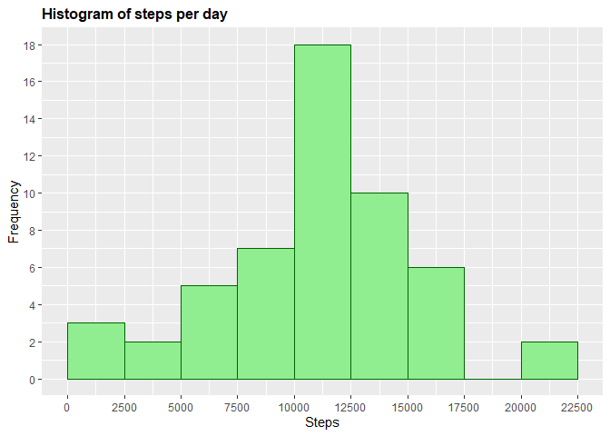
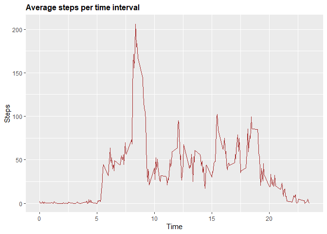
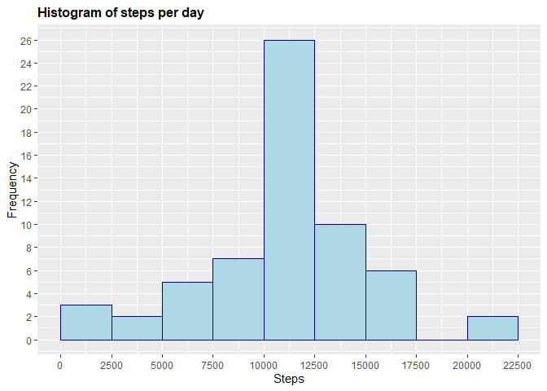
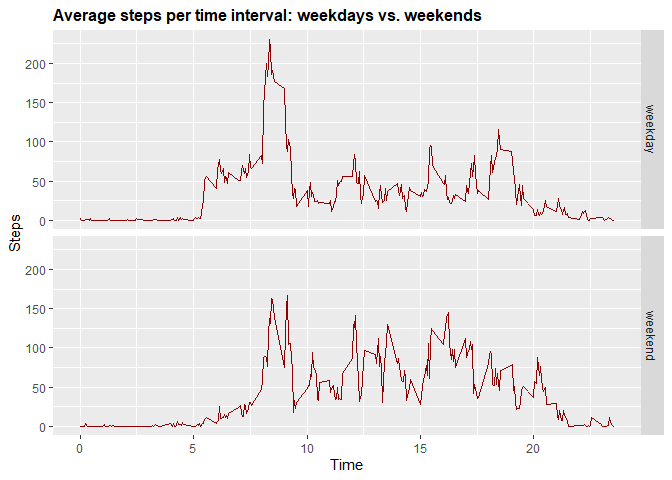

PA1\_template
================

# Unzip data to obtain a csv file.

``` r
knitr::opts_chunk$set(echo = TRUE)
if(!file.exists("getdata-projectfiles-UCI HAR Dataset.zip")) {
        temp <- tempfile()
        download.file("http://d396qusza40orc.cloudfront.net/repdata%2Fdata%2Factivity.zip",temp)
        unzip(temp)
        unlink(temp)
}

activity<-read.csv("activity.csv")
head(activity)
```

    ##   steps       date interval
    ## 1    NA 2012-10-01        0
    ## 2    NA 2012-10-01        5
    ## 3    NA 2012-10-01       10
    ## 4    NA 2012-10-01       15
    ## 5    NA 2012-10-01       20
    ## 6    NA 2012-10-01       25

# some information about the variables

``` r
str(activity)
```

    ## 'data.frame':    17568 obs. of  3 variables:
    ##  $ steps   : int  NA NA NA NA NA NA NA NA NA NA ...
    ##  $ date    : Factor w/ 61 levels "2012-10-01","2012-10-02",..: 1 1 1 1 1 1 1 1 1 1 ...
    ##  $ interval: int  0 5 10 15 20 25 30 35 40 45 ...

# As we can see, the variables included in this dataset are:

  - steps: Number of steps taking in a 5-minute interval (missing values
    are coded as NA)
  - date: The date on which the measurement was taken in YYYY-MM-DD
    format
  - interval: Identifier for the 5-minute interval in which measurement
    was taken

# Total number of steps taken per day

``` r
StepsPerDay <- aggregate(activity$steps, list(activity$date), FUN=sum)
colnames(StepsPerDay) <- c("Date", "Steps")
StepsPerDay
```

    ##          Date Steps
    ## 1  2012-10-01    NA
    ## 2  2012-10-02   126
    ## 3  2012-10-03 11352
    ## 4  2012-10-04 12116
    ## 5  2012-10-05 13294
    ## 6  2012-10-06 15420
    ## 7  2012-10-07 11015
    ## 8  2012-10-08    NA
    ## 9  2012-10-09 12811
    ## 10 2012-10-10  9900
    ## 11 2012-10-11 10304
    ## 12 2012-10-12 17382
    ## 13 2012-10-13 12426
    ## 14 2012-10-14 15098
    ## 15 2012-10-15 10139
    ## 16 2012-10-16 15084
    ## 17 2012-10-17 13452
    ## 18 2012-10-18 10056
    ## 19 2012-10-19 11829
    ## 20 2012-10-20 10395
    ## 21 2012-10-21  8821
    ## 22 2012-10-22 13460
    ## 23 2012-10-23  8918
    ## 24 2012-10-24  8355
    ## 25 2012-10-25  2492
    ## 26 2012-10-26  6778
    ## 27 2012-10-27 10119
    ## 28 2012-10-28 11458
    ## 29 2012-10-29  5018
    ## 30 2012-10-30  9819
    ## 31 2012-10-31 15414
    ## 32 2012-11-01    NA
    ## 33 2012-11-02 10600
    ## 34 2012-11-03 10571
    ## 35 2012-11-04    NA
    ## 36 2012-11-05 10439
    ## 37 2012-11-06  8334
    ## 38 2012-11-07 12883
    ## 39 2012-11-08  3219
    ## 40 2012-11-09    NA
    ## 41 2012-11-10    NA
    ## 42 2012-11-11 12608
    ## 43 2012-11-12 10765
    ## 44 2012-11-13  7336
    ## 45 2012-11-14    NA
    ## 46 2012-11-15    41
    ## 47 2012-11-16  5441
    ## 48 2012-11-17 14339
    ## 49 2012-11-18 15110
    ## 50 2012-11-19  8841
    ## 51 2012-11-20  4472
    ## 52 2012-11-21 12787
    ## 53 2012-11-22 20427
    ## 54 2012-11-23 21194
    ## 55 2012-11-24 14478
    ## 56 2012-11-25 11834
    ## 57 2012-11-26 11162
    ## 58 2012-11-27 13646
    ## 59 2012-11-28 10183
    ## 60 2012-11-29  7047
    ## 61 2012-11-30    NA

# Histogram of the total number of steps taken each day

``` r
library(ggplot2)
g <- ggplot(StepsPerDay, aes(Steps))
g+geom_histogram(boundary=0, binwidth=2500, col="darkgreen", fill="lightgreen")+ggtitle("Histogram of steps per day")+xlab("Steps")+ylab("Frequency")+theme(plot.title = element_text(face="bold", size=12))+scale_x_continuous(breaks=seq(0,25000,2500))+scale_y_continuous(breaks=seq(0,18,2))
```

    ## Warning: Removed 8 rows containing non-finite values (stat_bin).

<!-- -->

# Mean and median of total number of steps taken per day

``` r
#mean
mean(StepsPerDay$Steps, na.rm=TRUE)
```

    ## [1] 10766.19

``` r
#median
median(StepsPerDay$Steps, na.rm=TRUE)
```

    ## [1] 10765

# Average daily activity pattern

1.  Time series plot of the 5 minute interval (x) and averaged number of
    steps taken averaged across all days (y)

<!-- end list -->

``` r
# create table with steps per time
StepsPerTime <- aggregate(steps~interval,data=activity,FUN=mean,na.action=na.omit)
# variable time (more comprensible for the graph axis)
StepsPerTime$time <- StepsPerTime$interval/100
# draw the line plot
h <- ggplot(StepsPerTime, aes(time, steps))
h+geom_line(col="brown")+ggtitle("Average steps per time interval")+xlab("Time")+ylab("Steps")+theme(plot.title = element_text(face="bold", size=12))
```

<!-- -->

2.  5-minute interval (on average across all the days) with the maximum
    number of steps

<!-- end list -->

``` r
# table for dplyr
library(dplyr)
```

    ## 
    ## Attaching package: 'dplyr'

    ## The following objects are masked from 'package:stats':
    ## 
    ##     filter, lag

    ## The following objects are masked from 'package:base':
    ## 
    ##     intersect, setdiff, setequal, union

``` r
ST <- tbl_df(StepsPerTime)
# find the column
ST %>% select(time, steps) %>% filter(steps==max(ST$steps))
```

    ## # A tibble: 1 x 2
    ##    time steps
    ##   <dbl> <dbl>
    ## 1  8.35  206.

# Imputing missing values

1.  Total number of missing values in the dataset

<!-- end list -->

``` r
# table for dplyr
ACT <- tbl_df(activity)
# find the column
ACT %>% filter(is.na(steps)) %>% summarize(missing_values = n())
```

    ## # A tibble: 1 x 1
    ##   missing_values
    ##            <int>
    ## 1           2304

2.  Replace missing values

<!-- end list -->

``` r
activity$CompleteSteps <- ifelse(is.na(activity$steps), round(StepsPerTime$steps[match(activity$interval, StepsPerTime$interval)],0), activity$steps)
```

3.  New dataset that is equal to the original dataset but with the
    missing data filled in

<!-- end list -->

``` r
# new dataset activityFull
activityFull <- data.frame(steps=activity$CompleteSteps, interval=activity$interval, date=activity$date)
# see first 10 values of the new dataset
head(activityFull, n=10)
```

    ##    steps interval       date
    ## 1      2        0 2012-10-01
    ## 2      0        5 2012-10-01
    ## 3      0       10 2012-10-01
    ## 4      0       15 2012-10-01
    ## 5      0       20 2012-10-01
    ## 6      2       25 2012-10-01
    ## 7      1       30 2012-10-01
    ## 8      1       35 2012-10-01
    ## 9      0       40 2012-10-01
    ## 10     1       45 2012-10-01

4.  Histogram of the total number of steps taken each day with missing
    data filled in

<!-- end list -->

``` r
# prepare data
StepsPerDayFull <- aggregate(activityFull$steps, list(activityFull$date), FUN=sum)
colnames(StepsPerDayFull) <- c("Date", "Steps")
# draw the histogram
g <- ggplot(StepsPerDayFull, aes(Steps))
g+geom_histogram(boundary=0, binwidth=2500, col="darkblue", fill="lightblue")+ggtitle("Histogram of steps per day")+xlab("Steps")+ylab("Frequency")+theme(plot.title = element_text(face="bold", size=12))+scale_x_continuous(breaks=seq(0,25000,2500))+scale_y_continuous(breaks=seq(0,26,2))
```

<!-- --> 5.
Calculate and report the mean and median total number of steps taken per
day. Do these values differ from the estimates from the first part of
the assignment? What is the impact of imputing missing data on the
estimates of the total daily number of steps?

``` r
# Mean
mean(StepsPerDayFull$Steps)
```

    ## [1] 10765.64

``` r
#Median
median(StepsPerDayFull$Steps)
```

    ## [1] 10762

# The differences in activity patterns between weekdays and weekends

1.  Create a new factor variable in the dataset with two levels -
    “weekday” and “weekend” indicating whether a given date is a
    weekday or weekend day.

<!-- end list -->

``` r
# Create variable with date in correct format
activityFull$RealDate <- as.Date(activityFull$date, format = "%Y-%m-%d")
# create a variable with weekdays name
activityFull$weekday <- weekdays(activityFull$RealDate)
# create a new variable indicating weekday or weekend
activityFull$DayType <- ifelse(activityFull$weekday=='Saturday' | activityFull$weekday=='Sunday', 'weekend','weekday')
# see first 10 values
head(activityFull, n=10)
```

    ##    steps interval       date   RealDate weekday DayType
    ## 1      2        0 2012-10-01 2012-10-01  Monday weekday
    ## 2      0        5 2012-10-01 2012-10-01  Monday weekday
    ## 3      0       10 2012-10-01 2012-10-01  Monday weekday
    ## 4      0       15 2012-10-01 2012-10-01  Monday weekday
    ## 5      0       20 2012-10-01 2012-10-01  Monday weekday
    ## 6      2       25 2012-10-01 2012-10-01  Monday weekday
    ## 7      1       30 2012-10-01 2012-10-01  Monday weekday
    ## 8      1       35 2012-10-01 2012-10-01  Monday weekday
    ## 9      0       40 2012-10-01 2012-10-01  Monday weekday
    ## 10     1       45 2012-10-01 2012-10-01  Monday weekday

2.  Two time series plot of the 5-minute interval (x) and the average
    number of steps taken averaged across weekday days or weekend days
    (y).

<!-- end list -->

``` r
# create table with steps per time across weekdaydays or weekend days
StepsPerTimeDT <- aggregate(steps~interval+DayType,data=activityFull,FUN=mean,na.action=na.omit)
# variable time (more comprensible for the graph axis)
StepsPerTimeDT$time <- StepsPerTime$interval/100
# draw the line plot
j <- ggplot(StepsPerTimeDT, aes(time, steps))
j+geom_line(col="darkred")+ggtitle("Average steps per time interval: weekdays vs. weekends")+xlab("Time")+ylab("Steps")+theme(plot.title = element_text(face="bold", size=12))+facet_grid(DayType ~ .)
```

<!-- -->
